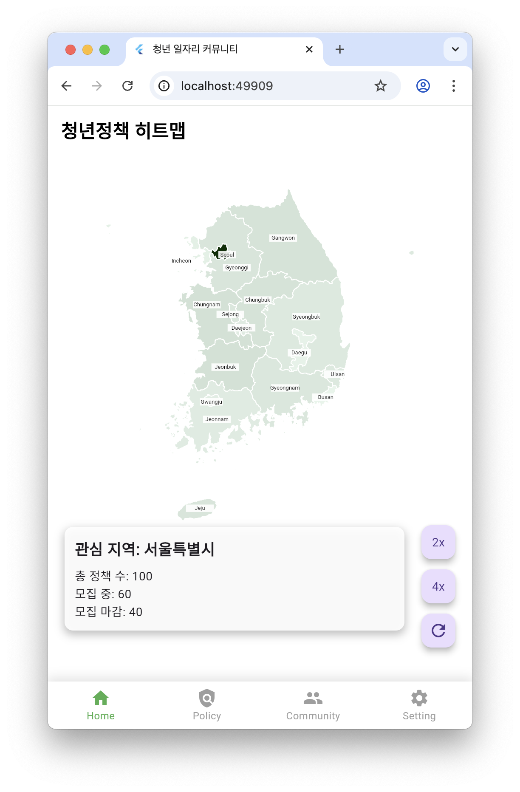
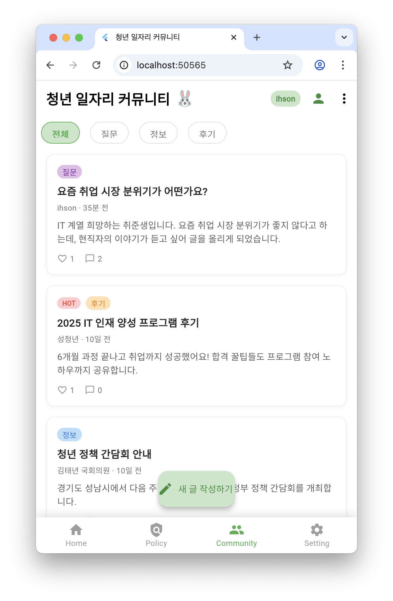

# 🐰 Youth Job Policy Evaluation App

> **A comprehensive platform for youth policy evaluation and community engagement**  
> Visualize, evaluate, and discuss youth employment policies all in one place.

<div align="center">


[](https://opensource.org/licenses/MIT)
[](http://makeapullrequest.com)
[](https://github.com/yourusername/youth-policy-app/stargazers)

</div>

---

## 🚀 Features

### 🗺️ **Interactive Policy Heatmap**
- **Regional policy visualization** at a glance
- **Interactive map interface** for intuitive navigation
- **Real-time data** integration
- **Geographic policy distribution** analysis

### 📋 **Policy Management System**
- **Active policies** listing with detailed information
- **Archived policies** for historical reference
- **5-star rating system** for policy evaluation
- **Advanced search and filtering** capabilities
- **Policy categorization** and tagging

### 💬 **Community Platform**
- **Real-time posting** and commenting system
- **Category-based organization** (Questions, Information, Reviews)
- **Personal post management** (My Posts)
- **Full CRUD operations** (Create, Read, Update, Delete)
- **User authentication** and profile management

### 🤖 **AI-Powered Job Matching**
- **Resume photo upload** functionality
- **AI-based job recommendations** using computer vision
- **Personalized job matching** algorithm
- **Skills extraction** from resume images

---

## 📸 Screenshots

<div align="center">

| Home Screen | Policy Map | Community |
|-------------|------------|-----------|
|  |  |  |

| Policy Details | Rating System | Profile |
|----------------|---------------|---------|
|  |  |  |

</div>

---

## 🛠️ Tech Stack

### **Frontend**
- **Flutter** - Cross-platform mobile development
- **Dart** - Programming language
- **Material Design** - UI/UX framework

### **Backend & Database**
- **Firebase Firestore** - NoSQL cloud database
- **Firebase Authentication** - User management
- **Firebase Storage** - File storage for images
- **Firebase Functions** - Serverless backend logic

### **Additional Libraries**
- **Cloud Firestore** - Real-time database operations
- **Firebase Auth** - Authentication services
- **Image Picker** - Camera and gallery access
- **HTTP** - API communication
- **Provider** - State management

---

## 🏗️ Architecture

```
lib/
├── models/           # Data models
│   ├── post.dart
│   ├── comment.dart
│   ├── policy.dart
│   └── user.dart
├── screens/          # UI screens
│   ├── home_screen.dart
│   ├── policy_screen.dart
│   ├── community_screen.dart
│   └── profile_screen.dart
├── services/         # Business logic
│   ├── firebase_service.dart
│   ├── auth_service.dart
│   └── api_service.dart
├── widgets/          # Reusable components
│   ├── post_card.dart
│   ├── policy_card.dart
│   └── custom_widgets.dart
└── utils/            # Helper functions
    ├── constants.dart
    └── helpers.dart
```

---

## 🚀 Getting Started

### Prerequisites

- **Flutter SDK** (>=3.0.0)
- **Dart SDK** (>=2.17.0)
- **Android Studio** / **VS Code**
- **Firebase Account**

### Installation

1. **Clone the repository**
   ```bash
   git clone https://github.com/yourusername/youth-policy-app.git
   cd youth-policy-app
   ```

2. **Install dependencies**
   ```bash
   flutter pub get
   ```

3. **Firebase Configuration**
   - Create a new Firebase project
   - Add Android/iOS app to your Firebase project
   - Download `google-services.json` (Android) or `GoogleService-Info.plist` (iOS)
   - Place the config files in appropriate directories:
     - Android: `android/app/google-services.json`
     - iOS: `ios/Runner/GoogleService-Info.plist`

4. **Enable Firebase Services**
   - **Firestore Database**
   - **Authentication** (Email/Password)
   - **Storage**

5. **Run the app**
   ```bash
   flutter run
   ```

### Firebase Security Rules

```javascript
// Firestore Security Rules
rules_version = '2';
service cloud.firestore {
  match /databases/{database}/documents {
    // Posts collection
    match /posts/{postId} {
      allow read: if true;
      allow create: if request.auth != null;
      allow update, delete: if request.auth != null 
        && request.auth.uid == resource.data.authorId;
    }
    
    // Comments collection
    match /comments/{commentId} {
      allow read: if true;
      allow create: if request.auth != null;
      allow update, delete: if request.auth != null 
        && request.auth.uid == resource.data.authorId;
    }
    
    // Policies collection
    match /policies/{policyId} {
      allow read: if true;
      allow write: if request.auth != null;
    }
  }
}
```

---

## 📊 Features in Detail

### **Policy Evaluation System**
- **5-star rating** with visual feedback
- **Review comments** for detailed feedback
- **Statistical analysis** of policy effectiveness
- **Trend tracking** over time

### **Community Features**
- **Real-time messaging** with Firebase Firestore
- **User profiles** with customizable information
- **Post categorization** for better organization
- **Search functionality** across all content

### **AI Job Matching**
- **Computer vision** for resume analysis
- **Machine learning algorithms** for job matching
- **Personalized recommendations** based on skills
- **Integration with job databases**

---

## 🤝 Contributing

We welcome contributions! Please see our [Contributing Guidelines](CONTRIBUTING.md) for details.

### Development Process

1. **Fork** the repository
2. **Create** a feature branch (`git checkout -b feature/amazing-feature`)
3. **Commit** your changes (`git commit -m 'Add amazing feature'`)
4. **Push** to the branch (`git push origin feature/amazing-feature`)
5. **Open** a Pull Request

### Code Style

- Follow [Dart Style Guide](https://dart.dev/guides/language/effective-dart/style)
- Use meaningful variable and function names
- Add comments for complex logic
- Write unit tests for new features

---

## 📱 Supported Platforms

- ✅ **Android** (API 21+)
- ✅ **iOS** (iOS 11.0+)
- 🚧 **Web** (Coming Soon)

---

## 🐛 Known Issues

- [ ] Map performance optimization needed for large datasets
- [ ] Offline functionality for community features
- [ ] Push notifications for policy updates

---

## 📄 License

This project is licensed under the MIT License - see the [LICENSE](LICENSE) file for details.

---

## 👥 Team

<div align="center">

| Role | Name | GitHub |
|------|------|--------|
| **Lead Developer** | Your Name | [@yourusername](https://github.com/yourusername) |
| **UI/UX Designer** | Designer Name | [@designer](https://github.com/designer) |
| **Backend Developer** | Backend Dev | [@backend](https://github.com/backend) |

</div>

---

## 🙏 Acknowledgments

- **Flutter Team** for the amazing framework
- **Firebase** for backend infrastructure
- **Material Design** for UI components
- **Open Source Community** for inspiration and libraries

---

<div align="center">

**⭐ Star this repo if you find it helpful!**

Made with ❤️ for the youth community

</div>
